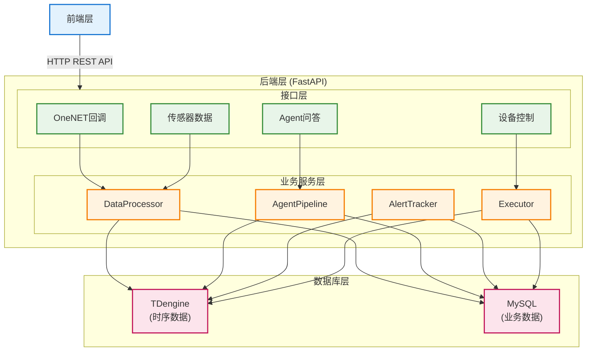
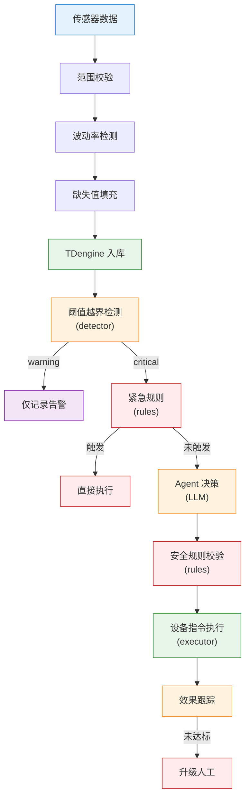

# 鱼跃云门智慧渔业养殖管理系统后端

基于 **IoT + AI Agent** 的智慧渔业养殖管理系统后端。从硬件/模拟器实时接收水质数据，清洗入库，前端轮询展示；水质异常时由 LLM Agent 自主分析决策，自动下发设备控制指令；异常持续超过 1 小时自动升级为人工处理。

## 系统架构



## 核心流程



## 核心功能

| 模块 | 说明 |
|------|------|
| 数据接收 | OneNET 平台 URL 验证 + 数据推送回调 |
| 数据清洗 | 范围校验（7项指标）、波动率检测（突变>50%告警但不丢弃）、滑动窗口均值填充 |
| 传感器数据 | 7 项指标：温度、pH、溶解氧、氨氮、亚硝酸盐、浊度、水位 |
| 三层防御 | 紧急规则（绕过LLM直接执行）→ Agent决策（LLM智能分析）→ 安全规则（执行前拦截） |
| Agent 决策 | LLM 分析水质 + 历史趋势 + 全局传感器 + 设备状态，输出结构化决策 JSON |
| 规则引擎 | 5条紧急规则 + 6条安全规则 + 3条效果跟踪规则，确保设备和鱼类安全 |
| 设备控制 | 增氧机/水泵/投饵机开关控制，冷却期保护（5分钟）+ 高风险动作需确认 |
| 效果跟踪 | 指令执行后 15 分钟自动检查指标改善情况，未达标自动升级 |
| 告警追踪 | APScheduler 每 30 秒扫描活跃告警，超过 60 分钟自动升级人工工单 |
| 人工工单 | pending → processing → resolved 状态流转，防重复创建 |
| 数据模拟器 | asyncio + aiohttp，正弦波模拟水质日变化，支持 6 种异常注入场景 |

## 技术栈

| 分类 | 技术 | 说明 |
|------|------|------|
| 框架 | FastAPI | Python 异步 Web 框架 |
| 语言 | Python 3.12+ | — |
| 时序数据库 | TDengine 3.3 | HTTP REST API 方式调用 |
| 业务数据库 | MySQL 8.0 | PyMySQL 参数化查询 |
| LLM | 智谱 GLM-4.5 | OpenAI 兼容接口，可通过 .env 切换 |
| 重试机制 | tenacity | LLM 调用指数退避重试（最多2次） |
| 定时任务 | APScheduler | BackgroundScheduler 后台线程 |
| 容器化 | Docker Compose | TDengine + MySQL 一键启动 |
| 模拟器 | aiohttp | 异步 HTTP 客户端上报数据 |

## 快速开始

### 1. 克隆项目

```bash
git clone <repository-url>
cd Fishery/Backend
```

### 2. 创建虚拟环境

```bash
python -m venv venv
venv\Scripts\activate     # Windows
```

### 3. 安装依赖

```bash
pip install -r requirements.txt
pip install openai tenacity python-dotenv pydantic-settings aiohttp python-dateutil
```

### 4. 配置环境变量

创建 `.env` 文件：

```env
# OneNET
ONENET_TOKEN=your_onenet_token

# TDengine
TDENGINE_URL=http://localhost:6041/rest/sql
TDENGINE_AUTH=Basic cm9vdDp0YW9zZGF0YQ==

# MySQL
MYSQL_HOST=localhost
MYSQL_PORT=3306
MYSQL_USER=root
MYSQL_PASSWORD=root123
MYSQL_DATABASE=fishery

# LLM（智谱 GLM-4.5）
LLM_API_KEY=your_glm_api_key
LLM_BASE_URL=https://open.bigmodel.cn/api/paas/v4/
LLM_MODEL=glm-4.5-flash

# 告警
ESCALATION_MINUTES=60
SCAN_INTERVAL_SECONDS=30

# 安全
COOLDOWN_MINUTES=5
EFFECT_CHECK_MINUTES=15
```

### 5. 启动服务

```bash
# 启动数据库
docker-compose up -d

# 初始化数据库（首次运行）
docker exec -it tdengine taos -f /root/fishery_td.sql
docker exec -it fishery-mysql mysql -uroot -proot123 fishery < sql/fishery_mysql.sql

# 启动后端
python app/main.py

# 启动模拟器（可选）
python simulator.py --pond-id pond1 --interval 5 --anomaly-rate 0.05
```

服务启动后访问：<http://localhost:8000>

### 6. 生产部署

```bash
pip install gunicorn
gunicorn app.main:app --workers 4 --worker-class uvicorn.workers.UvicornWorker --bind 0.0.0.0:8000
```

## API 接口

基础路径：`/api/`（OneNET 回调为 `/onenet/`）

### OneNET 回调

| 方法 | 路径 | 说明 |
|------|------|------|
| GET | `/onenet/callback` | URL 验证（MD5 签名校验） |
| POST | `/onenet/callback` | 数据接收（自动识别传感器数据/设备状态） |

### 传感器数据

| 方法 | 路径 | 说明 |
|------|------|------|
| GET | `/api/sensor-data` | 查询最新数据（默认最近 1 分钟，无数据回退最近 10 条） |
| GET | `/api/sensor-data/history` | 历史查询（必填 pond_id、start、end，可选 metrics） |
| POST | `/api/sensor-data/simulator/data` | 模拟器数据接入 |

### Agent 问答

| 方法 | 路径 | 说明 |
|------|------|------|
| POST | `/api/agent/chat` | AI 助手对话 |
| GET | `/api/agent/decisions` | Agent 决策记录（关联告警信息） |

**对话请求**：

```json
{ "message": "当前水质怎么样？" }
```

### 告警管理

| 方法 | 路径 | 说明 |
|------|------|------|
| GET | `/api/alerts/active` | 活跃告警列表（含持续时长、Agent 决策摘要） |
| GET | `/api/alerts/escalated` | 已升级告警列表 |

### 人工工单

| 方法 | 路径 | 说明 |
|------|------|------|
| GET | `/api/manual-tasks` | 工单列表（支持 status、pond_id 筛选） |
| POST | `/api/manual-tasks/{id}/process` | 标记处理中（status → processing） |
| POST | `/api/manual-tasks/{id}/resolve` | 标记已处理（status → resolved） |

### 设备控制

| 方法 | 路径 | 说明 |
|------|------|------|
| GET | `/api/control-devices` | 设备列表（支持 pond_id 筛选） |
| POST | `/api/control-devices/{identifier}/command` | 手动下发控制指令 |

**下发指令**：

```json
{
    "command_type": "start_aerator",
    "params": { "duration": 30 }
}
```

**可用指令**：`start_aerator` / `stop_aerator`（增氧机）、`start_pump` / `stop_pump`（水泵）、`start_feeder` / `stop_feeder`（投饵机）

## 警报阈值

在 [config.py](file:///d:/@works/Fishery/Backend/app/core/config.py#L19-L27) 中配置：

| 指标 | 临界值 (critical) | 预警值 (warning) |
|------|-------------------|-------------------|
| 溶解氧 | < 3.0 mg/L | < 5.0 mg/L |
| 水温 | < 15℃ / > 32℃ | > 28℃ |
| pH | < 6.5 / > 8.5 | — |
| 氨氮 | > 0.5 mg/L | > 0.2 mg/L |
| 亚硝酸盐 | > 0.3 mg/L | > 0.1 mg/L |
| 浊度 | > 500 NTU | — |
| 水位 | < 1.0m / > 3.0m | — |

## 防御体系

系统设计了三层防御架构，确保设备和鱼类安全：

### 第一层：紧急规则（最高优先级，绕过 LLM）

数据入库后立即检查，触发时直接执行，不经过 LLM：

| 条件 | 动作 |
|------|------|
| 溶解氧 < 1.0 mg/L | 立即开增氧机（最高功率 60 分钟） |
| 水温 > 35℃ | 立即开增氧机降温 |
| pH < 6.0 或 > 9.5 | 立即报人工 |
| 氨氮 > 1.0 mg/L | 立即开水泵换水 |
| 水位 < 0.5m | 立即报人工 |

### 第二层：Agent 决策（LLM 智能分析）

critical 级别告警触发，构建全局上下文（所有传感器 + 设备状态 + 历史 10 分钟趋势）→ LLM 分析 → 结构化 JSON 决策。LLM 调用失败时自动回退到规则引擎兜底。

### 第三层：安全规则（执行前拦截）

| 规则 | 条件 | 动作 |
|------|------|------|
| DO 安全 | 溶解氧 < 3 mg/L | 禁止关闭增氧机/水泵 |
| 高温保护 | 水温 > 30℃ | 禁止关闭增氧机 |
| pH 保护 | pH < 6.5 或 > 8.5 | 禁止关闭水泵 |
| 高风险确认 | stop_aerator / stop_pump | 需人工确认 |

## 代码结构

```
Backend/
├── app/
│   ├── main.py                    # FastAPI 入口，路由注册，lifespan 管理
│   ├── api/v1/
│   │   ├── deps.py                # DataProcessor 依赖注入
│   │   └── endpoints/
│   │       ├── onenet.py          # OneNET 回调（URL 验证 + 数据接收）
│   │       ├── sensor.py          # 传感器数据（实时查询 + 历史查询 + 模拟器接入）
│   │       ├── chat.py            # Agent 问答 + 决策记录
│   │       ├── alert.py           # 告警管理（活跃告警 + 已升级告警）
│   │       ├── task.py            # 人工工单（查询 + 处理中 + 已处理）
│   │       └── device.py          # 设备控制（设备列表 + 手动下发指令）
│   ├── core/
│   │   ├── config.py              # 统一配置（Pydantic Settings，.env 加载）
│   │   └── db.py                  # 数据库操作（TDengine HTTP API + MySQL PyMySQL）
│   ├── agents/
│   │   ├── config.py              # LLM 配置（从 .env 读取）
│   │   ├── core.py                # Agent 问答（一般对话）
│   │   ├── decision.py            # Agent 决策（异常分析，重试 + 规则兜底）
│   │   ├── prompt.py              # 问答系统提示词
│   │   └── prompt_decision.py     # 决策系统提示词
│   ├── tools/
│   │   ├── detector.py            # 异常检测（阈值越界 + 趋势预警）
│   │   ├── rules.py               # 规则引擎（紧急规则 + 安全规则 + 效果跟踪）
│   │   ├── executor.py            # 指令执行（冷却期 + 安全校验 + 效果检查）
│   │   └── alert_tracker.py       # 告警追踪（定时扫描 + 超时升级）
│   ├── services/
│   │   ├── data_processor.py      # 数据处理器（清洗 + 填充 + 入库 + 告警触发）
│   │   └── agent_pipeline.py      # Agent 决策链路（全局上下文 → LLM → 执行 → 记录）
│   └── models/
│       ├── schemas.py             # Pydantic DTO（请求/响应模型）
│       └── domain.py              # 领域实体（AlertEvent dataclass）
├── sql/
│   ├── fishery_td.sql             # TDengine 建表 DDL
│   └── fishery_mysql.sql          # MySQL 建表 DDL + 初始化数据
├── simulator.py                   # 数据模拟器（可配置异常注入）
├── docker-compose.yml             # TDengine + MySQL 容器编排
├── requirements.txt               # Python 依赖
├── .env                           # 环境变量（不进 git）
└── README.md
```

## 开发规范

- Python 文件：`snake_case`；API 路由：`/api/资源名`；数据库表：`snake_case`
- 密钥从 `.env` 读取，不进代码、不进 git
- 数据库变更先改 SQL 脚本，再改代码
- LLM 调用超时 30s，重试 2 次（指数退避），失败自动规则兜底
- LLM API 并发保护（互斥锁 + 最小 3 秒请求间隔）
- MySQL 参数化查询，TDengine 注意字符串转义
- 改完代码 `python app/main.py` 启动验证

## 常见问题

**Q: TDengine 连接失败？**

A: 检查 Docker 容器 `docker ps`，确认端口 `curl http://localhost:6041/rest/sql`，认证信息为 `root:taosdata` 的 base64 编码。

**Q: LLM 调用失败？**

A: 检查 `.env` 中 `LLM_API_KEY`、`LLM_BASE_URL`、`LLM_MODEL`。LLM 失败时会自动回退到规则引擎兜底决策，不会中断数据接收。

**Q: 模拟器数据无法上报？**

A: 确保后端已启动，默认上报地址 `http://127.0.0.1:8000`，可通过 `--base-url` 修改。

**Q: 告警追踪不工作？**

A: 检查 `app/main.py` 的 `lifespan` 中是否调用了 `start_tracker()`。

**Q: MySQL 设备映射报错？**

A: 确保已执行 `sql/fishery_mysql.sql` 初始化 `device_mapping` 表。模拟器默认使用 `sim_dev_001` 设备 ID。
